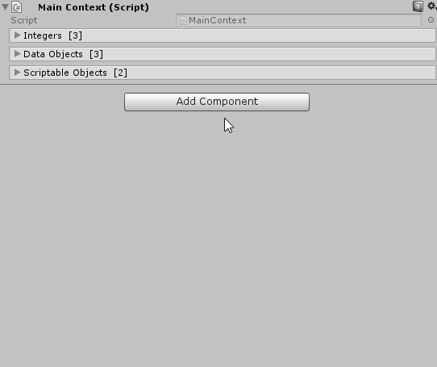

# UnityLabs.ReorderableListEditor

Custom editor to allow re-orderable lists/arrays in Unity Inspector by default.



This is inspired by Valentin Simonov's blog article here: http://va.lent.in/unity-make-your-lists-functional-with-reorderablelist/ , along with additional tweaks/functionality.

This custom editor overrides Unity's default SerializedProperty drawing for arrays and lists.  
The majority of the Editor code in this project is protected/virtual, allowing developers an easy to write custom editors that use/extend this reordering feature.  
  
The above gif is the automatic result of writing the following code:  

```csharp

[Serializable]
public struct MyData
{
    [SerializeField]
    private string _name;
    [SerializeField] [Range (0f, 1f)]
    private float _floatInRange;
}

public class MainContext : MonoBehaviour
{
    [SerializeField]
    private int[] _integers;

    [SerializeField]
    private MyData[] _dataObjects;

    [SerializeField]
    private ScriptableObject[] _scriptableObjects;
}
```  

## Usage

* Drop the `UnityLabs.ReorderableListEditor.dll` file (from the [Releases tab](https://github.com/andeart/UnityLabs.ReorderableListEditor/releases)) in your Unity project. Any sub-directory under `Assets` should work fine.
* Optional: Also drop the `UnityLabs.ReorderableListEditor.pdb` and ``UnityLabs.ReorderableListEditor.xml` files in the same location, if you're interested in debugging.
* You're all set.

## Feedback

Please feel free to send merge requests, or drop me a message. Cheers!